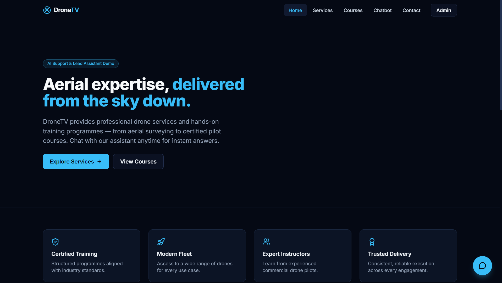
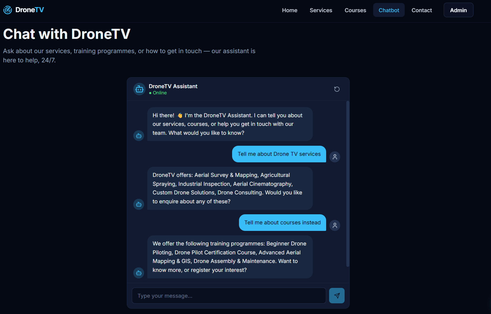
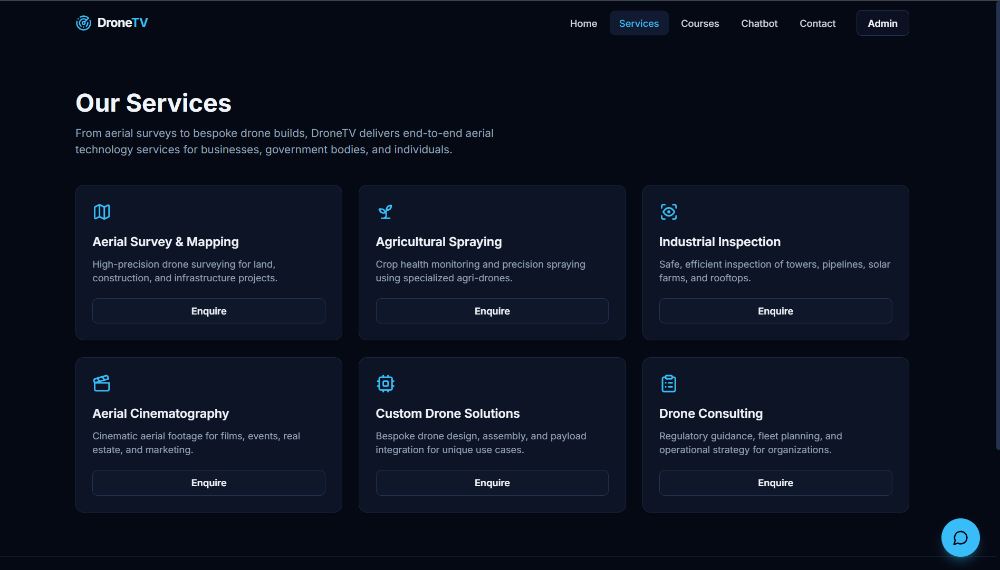
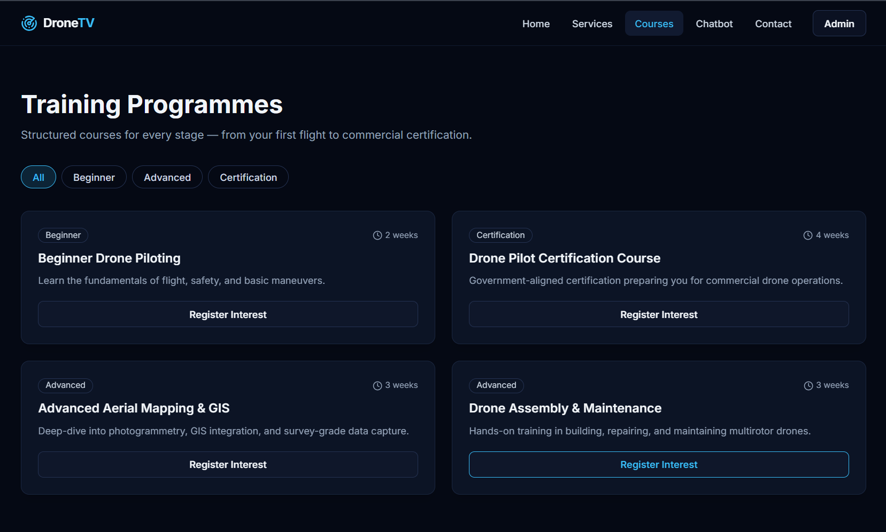
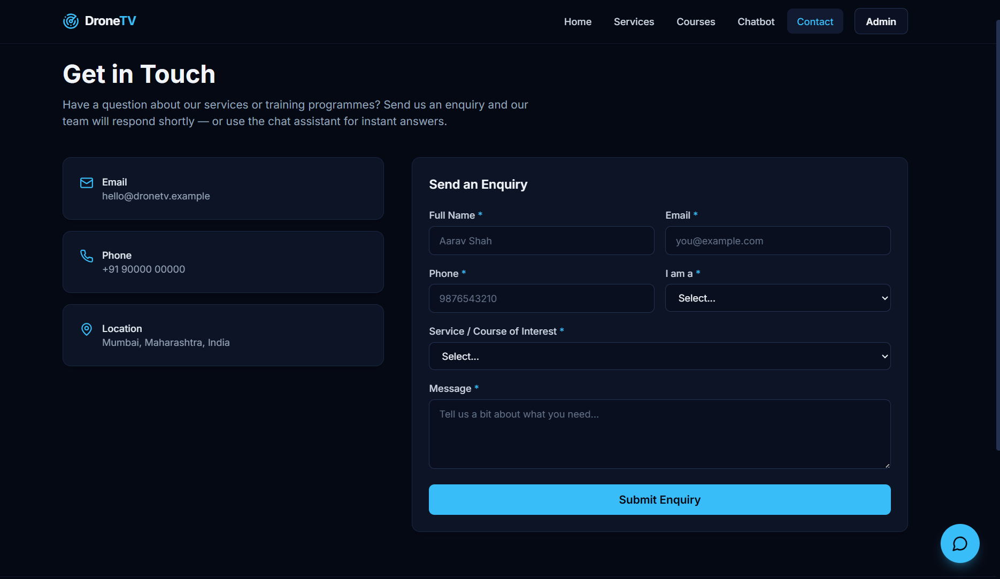
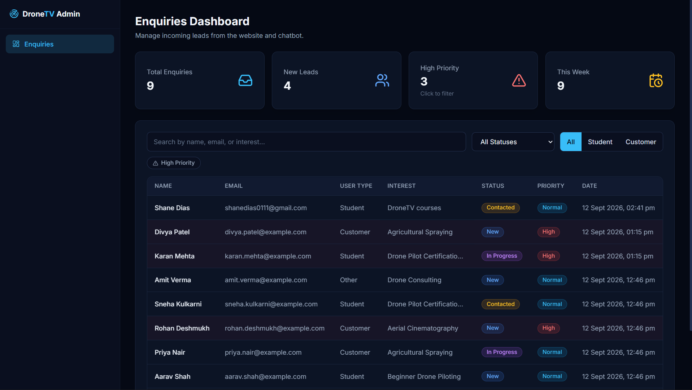
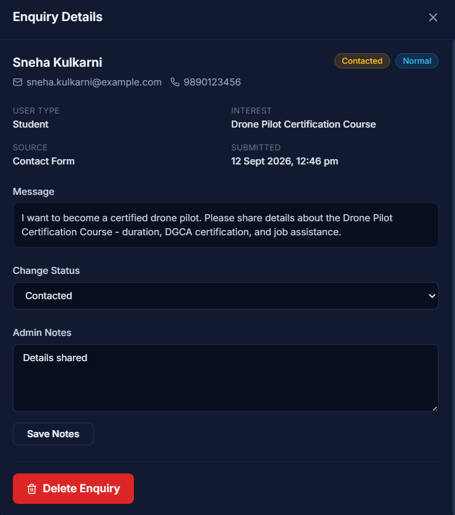

# DroneTV — AI Support & Lead Assistant

A full-stack web application providing a responsive marketing site for DroneTV's drone services and training programmes, a rule-based AI chatbot for instant support, an enquiry/lead capture system, and a secured admin dashboard for managing incoming leads.

---

## Table of Contents

- [Project Description](#project-description)
- [Features](#features)
- [Technologies Used](#technologies-used)
- [Project Structure](#project-structure)
- [Setup Instructions](#setup-instructions)
- [Environment Variables](#environment-variables)
- [Database Setup](#database-setup)
- [API Endpoints](#api-endpoints)
- [Screenshots](#screenshots)
- [Running the Application](#running-the-application)

---

## Project Description

Visitors can browse DroneTV's services and courses, submit enquiries via a contact form, or chat with an AI-style assistant that answers predefined questions and can capture a lead directly within the conversation. Every enquiry — whether from the contact form or the chatbot — is stored in MongoDB and surfaced in a protected admin dashboard where staff can search, filter by status/user type/priority, review full conversation transcripts, update status, add internal notes, change priority, and delete records. A lead scoring engine automatically assigns a numeric score and priority level (Low / Normal / High) to every incoming enquiry based on signals such as source, user type, message detail, and keyword intent.

---

## Features

### Public Site
- Fully responsive design (desktop / tablet / mobile) across all pages
- **Home** — hero section, highlights, services teaser, courses teaser, and a CTA
- **Services** — six service cards (Aerial Survey & Mapping, Agricultural Spraying, Industrial Inspection, Aerial Cinematography, Custom Drone Solutions, Drone Consulting) each with a one-click enquiry modal
- **Training Programmes** — four courses filterable by level (Beginner / Advanced / Certification), each with a register-interest modal
- **Contact** — full validated enquiry form (name, email, phone, user type, interest, message)
- **Chatbot page** — full-screen embedded chatbot interface

### Chatbot
- Floating chat widget available on every public page
- Intent-based rule engine with fuzzy / typo-tolerant keyword matching and synonym support
- Quick reply buttons for guided navigation
- Lead capture flow — opens an inline form mid-conversation and submits the enquiry with the full conversation transcript attached
- Affirmative intent ("yes", "sure", "let's go" etc.) for natural confirmation flows
- Context-aware fallback messages that vary after repeated mismatches
- Cancel acknowledgement with suggested next steps
- Post-submission quick replies for continued exploration
- Session reset button

### Admin Dashboard
- Protected by JWT (HTTP-only cookie); unauthenticated requests redirect to `/admin/login`
- Stats cards: Total Enquiries, New Leads, High Priority (clickable — applies priority filter), This Week
- Search by name, email, or interest
- Filter by status (New / Contacted / In Progress / Closed), user type (Student / Customer), and priority (High Priority pill toggle)
- Sortable, paginated enquiry table with Priority badge column and red-tint row highlight for High Priority enquiries
- Enquiry details drawer: full contact info, message, conversation transcript, status change, admin notes, priority badge, delete with confirmation
- Admin notes correctly re-initialise per enquiry (no stale state bleed between records)

### Backend
- Full CRUD REST API for enquiries with server-side search, filtering (status, userType, priority), sorting, and pagination
- Automatic lead scoring on every submission (0–100 scale; High ≥ 65, Low < 35)
- JWT + bcrypt admin authentication
- Centralized error handling — no internal error details are ever exposed to the client
- Security hardening: Helmet, CORS allow-listing, rate limiting (20 req/15 min on enquiry submission; 10 req/15 min on login), NoSQL-injection sanitisation, environment-variable-only secrets

---

## Technologies Used

| Layer | Technology |
|---|---|
| **Frontend** | React 18, TypeScript, Vite, Tailwind CSS 3 |
| **Routing** | React Router v6 |
| **Server state** | TanStack Query (React Query) v5 |
| **Forms & validation** | React Hook Form + Zod |
| **HTTP client** | Axios |
| **Icons** | Lucide React |
| **Notifications** | React Hot Toast |
| **Backend** | Node.js, Express 4, TypeScript |
| **ODM** | Mongoose 8 |
| **Database** | MongoDB (Atlas or local) |
| **Auth** | JSON Web Tokens (jsonwebtoken) + bcryptjs, HTTP-only cookie |
| **Security middleware** | Helmet, CORS, express-rate-limit, express-mongo-sanitize, cookie-parser |
| **Dev tooling** | nodemon, ts-node, ESLint |

---

## Project Structure

```
dronetv/
├── README.md
│
├── backend/                          # Node.js + Express + TypeScript REST API
│   ├── src/
│   │   ├── app.ts                    # Express app setup (middleware, routes)
│   │   ├── server.ts                 # HTTP server entry point
│   │   ├── config/
│   │   │   ├── db.ts                 # MongoDB connection
│   │   │   └── env.ts                # Typed environment variables
│   │   ├── controllers/
│   │   │   ├── auth.controller.ts    # Login, logout, me
│   │   │   └── enquiry.controller.ts # CRUD + dashboard stats
│   │   ├── middleware/
│   │   │   ├── auth.middleware.ts    # requireAdmin JWT guard
│   │   │   ├── errorHandler.middleware.ts
│   │   │   ├── rateLimiter.middleware.ts
│   │   │   └── validate.middleware.ts # Zod request body validation
│   │   ├── models/
│   │   │   ├── Admin.model.ts        # Admin schema + bcrypt comparePassword
│   │   │   └── Enquiry.model.ts      # Enquiry schema with indexes
│   │   ├── routes/
│   │   │   ├── auth.routes.ts
│   │   │   ├── dashboard.routes.ts
│   │   │   └── enquiry.routes.ts
│   │   ├── services/
│   │   │   ├── enquiry.service.ts    # Business logic, aggregations
│   │   │   └── leadScoring.service.ts # Heuristic lead score + priority
│   │   ├── types/
│   │   │   └── express.d.ts          # Express Request augmentation
│   │   ├── utils/
│   │   │   ├── ApiError.ts
│   │   │   ├── apiResponse.ts
│   │   │   ├── asyncHandler.ts
│   │   │   └── seedAdmin.ts          # One-time admin seed script
│   │   └── validators/
│   │       ├── auth.validator.ts
│   │       └── enquiry.validator.ts  # Zod schemas (source of truth)
│   ├── .env
│   ├── package.json
│   └── tsconfig.json
│
└── frontend/                         # React + TypeScript + Vite SPA
    ├── index.html
    ├── src/
    │   ├── App.tsx                   # Router, QueryClient, AuthProvider
    │   ├── index.css                 # Tailwind base + custom utility classes
    │   ├── components/
    │   │   ├── chatbot/
    │   │   │   ├── ChatInput.tsx
    │   │   │   ├── ChatWidget.tsx    # Floating toggle button
    │   │   │   ├── ChatWindow.tsx    # Chat UI + InlineLeadForm
    │   │   │   ├── MessageBubble.tsx
    │   │   │   └── QuickReplies.tsx
    │   │   ├── common/
    │   │   │   ├── Button.tsx
    │   │   │   ├── EmptyState.tsx
    │   │   │   ├── FormFields.tsx
    │   │   │   ├── Modal.tsx
    │   │   │   ├── ServiceIcon.tsx
    │   │   │   └── Spinner.tsx
    │   │   ├── dashboard/
    │   │   │   ├── EnquiryDetailsDrawer.tsx
    │   │   │   ├── EnquiryTable.tsx
    │   │   │   ├── FiltersBar.tsx
    │   │   │   ├── StatsCards.tsx
    │   │   │   └── StatusBadge.tsx
    │   │   └── enquiry/
    │   │       └── EnquiryForm.tsx
    │   ├── hooks/
    │   │   ├── useAuth.tsx           # AuthContext + AuthProvider
    │   │   ├── useChatbot.ts         # Chatbot state machine
    │   │   └── useEnquiries.ts       # TanStack Query hooks (CRUD + stats)
    │   ├── layouts/
    │   │   ├── AdminLayout.tsx       # Sidebar + auth guard
    │   │   ├── MainLayout.tsx        # Navbar + Footer + ChatWidget
    │   │   ├── Navbar.tsx
    │   │   └── Footer.tsx
    │   ├── pages/
    │   │   ├── AdminDashboardPage.tsx
    │   │   ├── AdminLoginPage.tsx
    │   │   ├── ChatbotPage.tsx
    │   │   ├── ContactPage.tsx
    │   │   ├── CoursesPage.tsx
    │   │   ├── HomePage.tsx
    │   │   └── ServicesPage.tsx
    │   ├── services/
    │   │   ├── apiClient.ts          # Axios instance with base URL + cookies
    │   │   ├── chatbotEngine.ts      # Intent resolution (resolveIntent)
    │   │   └── enquiryService.ts     # API call wrappers
    │   ├── types/
    │   │   ├── api.ts
    │   │   ├── chat.ts
    │   │   └── enquiry.ts
    │   └── utils/
    │       ├── formatDate.ts
    │       ├── intents.ts            # Intent definitions + FALLBACK_QUICK_REPLIES
    │       ├── siteContent.ts        # SERVICES and COURSES data
    │       ├── statusColors.ts       # Tailwind class maps for badges
    │       └── stringSimilarity.ts   # Fuzzy match helpers
    ├── .env
    ├── package.json
    ├── postcss.config.js
    └── tsconfig.json
```

---

## Setup Instructions

### Prerequisites

- Node.js 18+ and npm
- MongoDB Atlas account (free tier works) **or** a local MongoDB instance

### 1. Clone the repository

```bash
git clone <repo-url>
cd dronetv
```

### 2. Install dependencies

```bash
# Backend
cd backend
npm install

# Frontend (in a new terminal)
cd ../frontend
npm install
```

### 3. Configure environment variables

```bash
# Backend
cd backend
cp .env.example .env   # or copy the template below and edit manually

# Frontend
cd ../frontend
cp .env.example .env   # or create manually
```

See [Environment Variables](#environment-variables) below for the full list.

### 4. Seed the admin account

Run this once to create the admin login record in MongoDB:

```bash
cd backend
npm run seed:admin
```

The credentials used are whatever you set as `SEED_ADMIN_EMAIL` and `SEED_ADMIN_PASSWORD` in `backend/.env`.

---

## Environment Variables

### Backend — `backend/.env`

| Variable | Required | Default | Description |
|---|---|---|---|
| `PORT` | No | `5000` | Port the Express server listens on |
| `NODE_ENV` | No | `development` | `development` or `production` |
| `MONGODB_URI` | **Yes** | — | Full MongoDB connection string (Atlas or local) |
| `JWT_SECRET` | **Yes** | — | Long random string used to sign JWT tokens |
| `JWT_EXPIRES_IN` | No | `2h` | JWT expiry (e.g. `2h`, `7d`) |
| `CLIENT_ORIGIN` | No | `http://localhost:5173` | Frontend URL for CORS allow-listing |
| `SEED_ADMIN_EMAIL` | No | `admin@dronetv.in` | Email for the seeded admin account |
| `SEED_ADMIN_PASSWORD` | No | `ChangeMe123!` | Password for the seeded admin account |
| `SEED_ADMIN_NAME` | No | `DroneTV Admin` | Display name for the seeded admin account |

Example `backend/.env`:

```env
PORT=5000
NODE_ENV=development
MONGODB_URI=mongodb+srv://<user>:<password>@cluster0.xxxxx.mongodb.net/dronetv?retryWrites=true&w=majority
JWT_SECRET=replace_with_a_long_random_string
JWT_EXPIRES_IN=2h
CLIENT_ORIGIN=http://localhost:5173
SEED_ADMIN_EMAIL=admin@dronetv.in
SEED_ADMIN_PASSWORD=ChangeMe123!
SEED_ADMIN_NAME=DroneTV Admin
```

### Frontend — `frontend/.env`

| Variable | Required | Default | Description |
|---|---|---|---|
| `VITE_API_BASE_URL` | **Yes** | — | Full URL to the backend API including `/api` (e.g. `http://localhost:5000/api`) |

Example `frontend/.env`:

```env
VITE_API_BASE_URL=http://localhost:5000/api
```

---

## Database Setup

The application uses **MongoDB** with two collections:

| Collection | Description |
|---|---|
| `enquiries` | All lead/enquiry records from the contact form and chatbot |
| `admins` | Admin user accounts (password stored as bcrypt hash) |

**No manual migration is needed.** Mongoose creates the collections, applies schema validation rules, and builds the following indexes automatically on first use:

- `enquiries`: `email`, `status`, `createdAt` (desc), compound `{ status, createdAt }`, and a text index on `name + email + interest` for search
- `admins`: unique index on `email`

### MongoDB Atlas (recommended)

1. Create a free cluster at [mongodb.com/cloud/atlas](https://www.mongodb.com/cloud/atlas)
2. Add a database user with read/write access
3. Allow your IP address (or `0.0.0.0/0` for development) in Network Access
4. Copy the connection string and set it as `MONGODB_URI` in `backend/.env`

### Local MongoDB

If you have MongoDB installed locally, set:

```env
MONGODB_URI=mongodb://localhost:27017/dronetv
```

---

## API Endpoints

All endpoints are prefixed with `/api`. Requests and responses use JSON. Admin-protected routes require a valid JWT stored as an HTTP-only cookie (set automatically on login).

### Health

| Method | Endpoint | Auth | Description |
|---|---|---|---|
| `GET` | `/api/health` | Public | Returns `{ success: true, uptime: <seconds> }` |

### Authentication

| Method | Endpoint | Auth | Description |
|---|---|---|---|
| `POST` | `/api/auth/login` | Public | Accepts `{ email, password }`. Sets JWT cookie. Returns admin object. Rate-limited to 10 req / 15 min. |
| `POST` | `/api/auth/logout` | Public | Clears the JWT cookie. |
| `GET` | `/api/auth/me` | Admin | Returns the currently authenticated admin. |

### Enquiries

| Method | Endpoint | Auth | Description |
|---|---|---|---|
| `POST` | `/api/enquiries` | Public | Submit a new enquiry. Triggers lead scoring. Rate-limited to 20 req / 15 min. |
| `GET` | `/api/enquiries` | Admin | List all enquiries. Supports query params: `status`, `userType`, `priority`, `search`, `page`, `limit`, `sort`. |
| `GET` | `/api/enquiries/:id` | Admin | Get a single enquiry by ID. |
| `PATCH` | `/api/enquiries/:id` | Admin | Update `status`, `priority`, and/or `adminNotes`. |
| `PUT` | `/api/enquiries/:id` | Admin | Full update (same fields accepted as PATCH). |
| `DELETE` | `/api/enquiries/:id` | Admin | Permanently delete an enquiry. |

#### `POST /api/enquiries` — Request body

```json
{
  "name": "Jane Doe",
  "email": "jane@example.com",
  "phone": "0712345678",
  "userType": "Student",
  "interest": "Drone Pilot Certification Course",
  "message": "I'd like to register for the next intake.",
  "source": "Contact Form",
  "conversation": []
}
```

#### `GET /api/enquiries` — Query parameters

| Param | Type | Example | Description |
|---|---|---|---|
| `status` | string | `New` | Filter by status (`New`, `Contacted`, `In Progress`, `Closed`) |
| `userType` | string | `Student` | Filter by user type (`Student`, `Customer`, `Other`) |
| `priority` | string | `High` | Filter by priority (`Low`, `Normal`, `High`) |
| `search` | string | `jane` | Full-text search across name, email, and interest |
| `page` | number | `1` | Page number (default: 1) |
| `limit` | number | `10` | Results per page (default: 20, max: 100) |
| `sort` | string | `-createdAt` | Sort field; prefix with `-` for descending |

#### `GET /api/enquiries` — Response

```json
{
  "success": true,
  "message": "Enquiries retrieved successfully",
  "data": [ /* array of enquiry objects */ ],
  "meta": {
    "total": 42,
    "page": 1,
    "limit": 10,
    "totalPages": 5
  }
}
```

### Dashboard

| Method | Endpoint | Auth | Description |
|---|---|---|---|
| `GET` | `/api/dashboard/stats` | Admin | Returns aggregate stats: `total`, `newLeads`, `highPriority`, `thisWeek`, `statusFunnel`, `userTypeSplit`, `topInterests` |

#### `GET /api/dashboard/stats` — Response

```json
{
  "success": true,
  "data": {
    "total": 42,
    "newLeads": 8,
    "highPriority": 5,
    "thisWeek": 12,
    "statusFunnel": { "New": 8, "Contacted": 14, "In Progress": 11, "Closed": 9 },
    "userTypeSplit": { "Student": 20, "Customer": 17, "Other": 5 },
    "topInterests": [
      { "interest": "Drone Pilot Certification Course", "count": 11 },
      { "interest": "Aerial Survey & Mapping", "count": 8 }
    ]
  }
}
```

### Lead Scoring Logic

Every new enquiry is automatically scored on submission (0–100 scale):

| Signal | Points |
|---|---|
| Baseline (any enquiry) | +30 |
| Source is Chatbot | +10 |
| User type is Student | +10 |
| User type is Customer | +15 |
| Message length > 60 characters | +10 |
| High-intent keywords in message/interest | +15 |
| Conversation length > 4 turns | +10 |

Priority is then assigned: **High** ≥ 65 · **Normal** 35–64 · **Low** < 35

---

## Screenshots

### Landing / Home Page


### Chatbot Interface


### Services Section


### Courses / Training Section


### Contact / Enquiry Form


### Admin Dashboard


### Single Enquiry Detail



---

## Running the Application

### Development

**Backend** (runs on `http://localhost:5000`):

```bash
cd backend
npm run dev
```

**Frontend** (runs on `http://localhost:5173`):

```bash
cd frontend
npm run dev
```

Open [http://localhost:5173](http://localhost:5173) in your browser.

Sign in to the admin panel at [http://localhost:5173/admin/login](http://localhost:5173/admin/login) using the credentials you configured in `SEED_ADMIN_EMAIL` and `SEED_ADMIN_PASSWORD`.

### Production Build

**Backend:**

```bash
cd backend
npm run build      # compiles TypeScript → dist/
npm start          # runs dist/server.js
```

**Frontend:**

```bash
cd frontend
npm run build      # outputs to dist/
npm run preview    # local preview of the production build
```

### Other Scripts

| Script | Directory | Description |
|---|---|---|
| `npm run seed:admin` | `backend/` | Creates the admin account in MongoDB. Run once after setup. |
| `npm run lint` | `backend/` or `frontend/` | Runs ESLint across all TypeScript source files. |

---

## Architecture Overview

```
Browser
  └─ React SPA (Vite)
       ├─ TanStack Query  ──────────────────────────────────────────────────────┐
       └─ Axios                                                                  │
                                                                                 ▼
                                                             Express API (Node.js + TypeScript)
                                                               ├─ Helmet · CORS · Rate Limiter
                                                               ├─ Zod Request Validation
                                                               ├─ JWT Auth Middleware
                                                               ├─ Controllers
                                                               ├─ Services (lead scoring, aggregations)
                                                               └─ Mongoose Models
                                                                        │
                                                                        ▼
                                                                   MongoDB Atlas
```

The chatbot's intent matching runs entirely client-side inside `resolveIntent()` (`frontend/src/services/chatbotEngine.ts`). Swapping it for an LLM API call later only requires changing that one function — no UI or state-management code needs to change.
